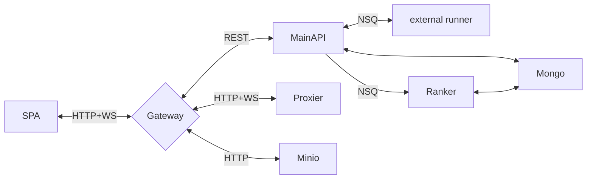

# 系统设计



- 评测和试验场是由单独的外部组件负责的，不在本 MonoRepo 中。
- 组件之间使用 NSQ 进行通信。
- 所有文件统一存储在 Minio 对象存储中。

## 约定

### 对象存储键值

- 题目
  - 题目数据：`problem/{problem_id}/data.tar`
  - 题面附件：`problem/{problem_id}/attachment/{filename}`
- 提交
  - 提交文件：`submission/{submission_id}/data.tar`
  - 评测日志：`submission/{submission_id}/log.txt`
  - 评测产物：`submission/{submission_id}/artifact/{filename}`

### NSQ 消息结构

统一使用 JSON 格式

#### Runner 相关

##### 评测请求

```ts
// topic: runner:judge:request
interface JudgeRequest {
  // 运行参数。该参数在Problem模型中定义。
  runner_args: string
  // 题面ID。请Runner从OSS获取题面数据。
  problem_id: string
  // 提交ID。请Runner从OSS获取提交数据。
  submission_id: string
}
```

##### 评测状态上报

```ts
// topic: runner:judge:status
interface JudgeStatus {
  // 提交ID。MainAPI将根据该ID更新评测状态。
  submission_id: string
  // 评测是否完成。MainAPI将根据此字段更新Submission的状态。
  done: boolean
  // 得分。倘若没有评测完成，请上报0。
  score: number
  // 消息。展示给用户的消息。
  message: string
  // 时间戳。在NSQ无序消息情形中，将据此字段判断是否更新。
  timestamp: number
}
```

##### 试验场操作请求

```ts
// topic: runner:sandbox:request
interface SandboxRequest {
  // 运行参数。该参数在Problem模型中定义。
  runner_args: string
  // 题面ID。请Runner从OSS获取题面数据。
  problem_id: string
  // 试验场ID。请Runner从OSS获取试验场数据。
  sandbox_id: string
  // 操作类型。注意，纵使销毁了一个试验场，他的ID仍然不变。
  operation: 'create' | 'destroy' | 'start' | 'stop'
}
```

##### 试验场状态上报

```ts
// topic: runner:sandbox:status
interface SandboxStatus {
  // 试验场ID。MainAPI将根据该ID更新试验场状态。
  sandbox_id: string
  // 操作类型。
  operation: 'create' | 'destroy' | 'start' | 'stop'
  // 操作是否成功。
  success: boolean
  // 附加的消息。
  message: string
  // 时间戳。将根据本字段生成推送通知。
  timestamp: number
}
```

#### 其他消息

##### 排名重计算请求

```ts
interface RankRequest {
  ranklist_id: string
}
```
